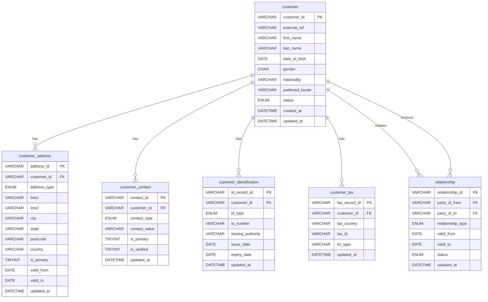

# ER Diagram — Offload POC Source Schema



## Relationship Notes

| Relationship | Cardinality | Description |
|---|---|---|
| customer → customer_address | one-to-many | A customer can have multiple addresses (residential, mailing, business) |
| customer → customer_contact | one-to-many | A customer can have multiple contact methods (email, mobile, phone) |
| customer → customer_identification | one-to-many | A customer can hold multiple ID documents (passport, licence, etc.) |
| customer → customer_tax | one-to-many | A customer can have tax records across multiple countries |
| customer → relationship (as from) | one-to-many | A customer can initiate multiple party-to-party relationships |
| customer → relationship (as to) | one-to-many | A customer can be the target of multiple party-to-party relationships |

## MongoDB Target Mapping

All 6 tables collapse into **one document per customer** in MongoDB:

```
customer_profile {
  customer_id        ← customer.customer_id
  ...core fields...  ← customer.*
  addresses[]        ← customer_address.*
  contacts[]         ← customer_contact.*
  identifications[]  ← customer_identification.*
  tax_records[]      ← customer_tax.*
  relationships[]    ← relationship.*
}
```
