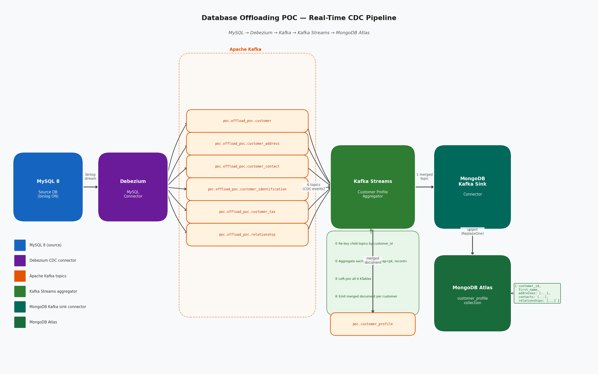

# Real-Time CDC Pipeline

## Diagram



---

## Overview

The pipeline streams every data change from MySQL into MongoDB Atlas in near real-time using a fully event-driven architecture. No batch jobs. No polling. Changes propagate end-to-end in under a second under normal load.

---

## Stages

### 1. MySQL 8 — Source
MySQL is configured with **binlog enabled in ROW format**, which records every insert, update, and delete at the row level. This is the same mechanism used by production RDS instances and is the closest simulation of mainframe CDC capture available in a relational database.

### 2. Debezium MySQL Connector — CDC Capture
Debezium connects to MySQL as a **replica** (using a dedicated CDC user with replication privileges) and tails the binlog continuously. For each row change it emits a structured event containing:
- `__op` — operation type: `c` (create), `u` (update), `d` (delete), `r` (snapshot read)
- the full `after` image of the row (flattened by the `ExtractNewRecordState` transform)

Debezium publishes one Kafka topic per table:

| Topic | Source Table |
|---|---|
| `poc.offload_poc.customer` | customer |
| `poc.offload_poc.customer_address` | customer_address |
| `poc.offload_poc.customer_contact` | customer_contact |
| `poc.offload_poc.customer_identification` | customer_identification |
| `poc.offload_poc.customer_tax` | customer_tax |
| `poc.offload_poc.relationship` | relationship |

### 3. Apache Kafka — Event Backbone
Kafka acts as the durable, replayable event log between the source and all consumers. Key properties:
- **At-least-once delivery** — no events are lost even if a consumer restarts
- **Offset-based replay** — any consumer can rewind and reprocess from any point
- **Fan-out** — multiple consumers can independently read the same topics

### 4. Kafka Streams — Profile Aggregator
This is the merge layer. The Kafka Streams app (`streams-app/`) runs a stateful topology:

1. **Re-key child topics** — `customer_address`, `customer_contact`, etc. are keyed by their own PKs; the app re-keys them all by `customer_id`
2. **Aggregate into KTables** — each child type is aggregated into a `Map<pk, record>` per customer, giving correct upsert/delete semantics without duplicates
3. **Left-join all 6 KTables** — the customer KTable is the root; all child KTables are left-joined in sequence to build the full profile
4. **Emit merged document** — every time any of the 6 inputs change, the updated merged document is emitted to `poc.customer_profile`

The output is a single Kafka topic `poc.customer_profile` where each message is a complete, self-contained customer profile document.

### 5. MongoDB Kafka Sink Connector — Final Write
The MongoDB Kafka Connector reads from `poc.customer_profile` and writes to the `customer_profile` collection in MongoDB Atlas using **`ReplaceOneDefaultStrategy`** — a full document replacement keyed by `customer_id`, giving idempotent upsert behaviour.

### 6. MongoDB Atlas — Offload Target
The `customer_profile` collection stores one document per customer containing all related data as embedded arrays:

```json
{
  "customer_id": "cust-0001",
  "external_ref": "EXT-0001",
  "first_name": "Alice",
  "last_name": "Nguyen",
  "status": "ACTIVE",
  "addresses": [
    { "address_type": "RESIDENTIAL", "city": "Sydney", "postcode": "2000" }
  ],
  "contacts": [
    { "contact_type": "EMAIL", "contact_value": "alice@example.com" }
  ],
  "identifications": [
    { "id_type": "PASSPORT", "id_number": "PA1234567" }
  ],
  "tax_records": [
    { "tax_country": "AUS", "tax_id": "123456789" }
  ],
  "relationships": [
    { "party_id_to": "cust-0002", "relationship_type": "JOINT_HOLDER" }
  ]
}
```

This document shape eliminates all joins at read time — a `findOne({ customer_id: "cust-0001" })` returns everything in a single round-trip.

---

## Why This Architecture

| Concern | How it is addressed |
|---|---|
| **No data loss** | Kafka durably stores all events; consumers can replay from any offset |
| **Idempotency** | Kafka Streams KTable semantics + MongoDB `ReplaceOne` — safe to reprocess |
| **Decoupling** | Source (MySQL) and target (MongoDB) are completely independent |
| **Near real-time** | End-to-end lag is typically < 1 second under normal load |
| **Read offload** | Consumers read from MongoDB instead of the source, eliminating source read pressure |
| **Extensibility** | Any new consumer can subscribe to `poc.customer_profile` without touching the source |

---

## What This POC Does Not Prove
- z/OS log capture or VSAM semantics
- IBM Classic CDC operational behaviour
- CICS or logstream integration

These are covered in the next phase when a real mainframe source replaces the MySQL simulator.
